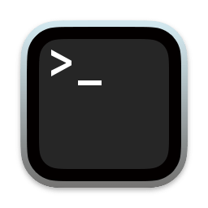

# Shell Scripts

Links to my various Zsh scripts for macOS. 
 
>[!NOTE]
>If a link doesn't work, it means I have that repo private.

## Emulators
- [RPCS3 for Arm](https://github.com/shinra-electric/RPCS3-Arm-Build-Script)
- [shadPS4](https://github.com/shinra-electric/shadPS4-Build-Script)
- [Hydra](https://github.com/shinra-electric/Hydra-Build-Script)

## Games
- [OpenDune](https://github.com/shinra-electric/OpenDune-Build-Script) Dune II: The Building of a Dynasty
- [OpenXray](https://github.com/shinra-electric/OpenXRay-Build-Script) S.T.A.L.K.E.R Call of Pripyat
- [re3 and reVC](https://github.com/shinra-electric/GTA-Build-Script) GTA III and Vice City
- [SDLPoP](https://github.com/shinra-electric/SDLPoP-Build-Script) Prince of Persia (DOS version)
- [vkMacQuake](https://github.com/shinra-electric/vkMacQuake-Build-Script) Quake and Arcane Dimensions
- [Medal of Honor](https://github.com/shinra-electric/Medal-Of-Honor-Build-Script) Allied Assault, Spearhead & Breakthrough
- [Perfect Dark](https://github.com/shinra-electric/Perfect-Dark-Build-Script) (N64 version)
- [Source Engine games](https://github.com/shinra-electric/Source-Engine-Build-Script) Half-Life Source, Half-Life 2, Half-Life Episodes 1 & 2, Portal
- [Stratagus](https://github.com/shinra-electric/Stratagus-Build-Script) Warcraft and Warcraft 2
- [Super Mario](https://github.com/shinra-electric/Mario-Build-Script) including Super Mario World, Super Mario Bros (SNES remake) and The Lost Levels (SNES)
- [Super Mario 64](https://github.com/shinra-electric/Mario64-Build-Script) (N64 version)
- [Super Metroid](https://github.com/shinra-electric/Super-Metroid) (SNES version)
- [WipEout-Rewrite](https://github.com/shinra-electric/WipEout-Rewrite-Build-Script) WipEout (PS1 version)
- [Zelda](https://github.com/shinra-electric/Zelda3-Build-Script) A Link to the Past (SNES version)

## Tools
- [StarCraft](https://github.com/shinra-electric/StarCraft-Offline-Patch) Standalone patch for the official version. Removes requirement for a Launcher or Battle.Net
- [Unreal & Unreal Tournament '99](https://github.com/shinra-electric/Unreal-Data-Extractor) Game data extractor
- [Warcraft 1 & 2](https://github.com/shinra-electric/Stratagus-Data-Extractor-Script) Game data extractor
- [Format conversion](https://github.com/shinra-electric/Conversion-Scripts) To CHD/CSO from ISO or BIN/CUE
